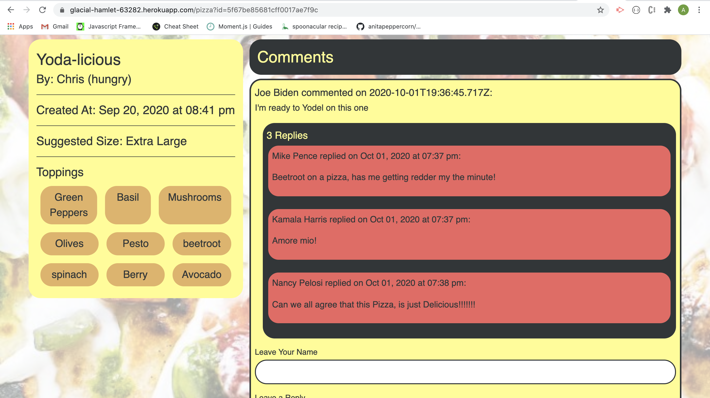

## Pizza Hunt

### Description

*Pizza Hunt—a self-aware riff on social-media applications that already exist for other topics—lets users connect with each other based on their love of pizza. In Pizza Hunt, users can share and discuss their dream pizza-topping combinations. Pizza is ubiquitous in everyday life all over the world, and no application has ever been created with the sole purpose of facilitating discussions about it.*

### App Screenshot

### App Deployed to Heroku

https://glacial-hamlet-63282.herokuapp.com

### Concepts Covered

- Used MongDB Atlas to host the database remotely.
- Created models with Mongoose.
- Used virtuals to extend the models' functionality.
- Created subschemas and subdocuments with Mongoose.
- Used IndexedDB to add offline functionality.
- Validated models to normalize data.
